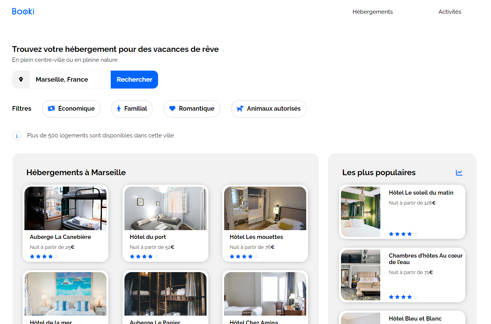

# Booki

## Presentation:

Figma models [here](https://www.figma.com/file/r9YJyUkpVdrxzBBKGH7reY/Maquettes-Booki-(desktop%2C-mobile%2C-tablette)?type=design&mode=design)

## Live demo is available on Github Pages [here](https://zhannazucher.github.io/Projet-2/)

## Local setup

1. Clone and/or fork this repository.
2. Then start your Live Server